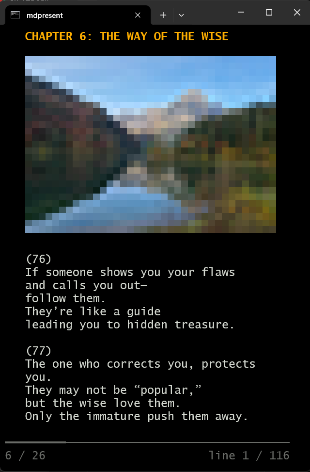
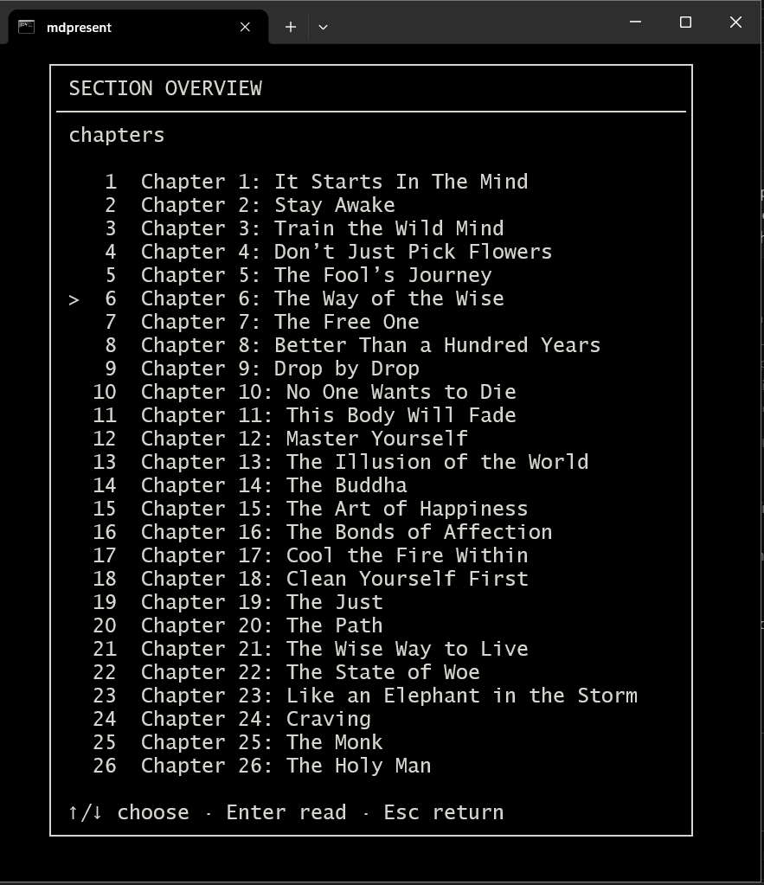

# About Dhammapada for Terminal

Read the Dhammapada in your terminal with [MDPresent](https://github.com/kevinkoosk/mdpresent), my terminal markdown tool.

The Dhammapada is one of the basic texts of Buddhism.

This version is based on the translation by Acharya Buddharakkhita, but paraphrased and modernized. (Similar to The Message Bible.)

## Screenshots





## How to run

I compiled MDPresent to run on Windows.

From your terminal, run 
```
mdpresent dhammapada.mdp
```

Alternatively, click on `read.bat` to run it.

## Keyboard Bindings

? - help

o - choose chapter

esc - exit

up/down - scroll

left/right - previous/next chapter.

## License

Published under the MIT License.

