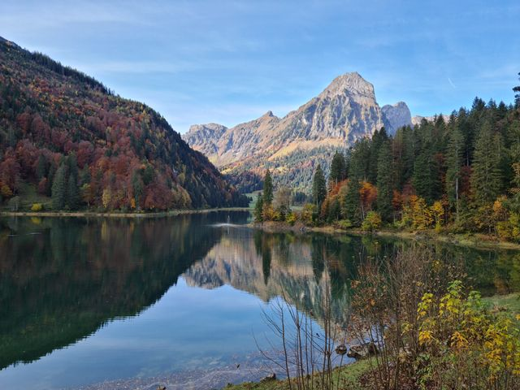

# Chapter 18: Clean Yourself First

(235)
You’re like a dry leaf.
Death is just around the corner.
Your journey's about to begin—
and you haven’t packed.

(236)
Build an island for yourself.
Work hard.
Get wise.
Clear your mind.
Then you’ll join the Noble Ones
beyond the storm.

(237)
You’re headed to the king of death.
And there's no rest stops on the road.
But you’ve made no preparations.

(238)
So make your own refuge.
Clean your life.
If you do,
you won’t be reborn again
into this mess of decay.

(239)
Clean your heart
like a goldsmith refines silver—
patiently,
little by little,
bit by bit.

(240)
Rust eats iron from the inside.
Same with people—
your own bad choices
are what take you down.

(241)
Scriptures rot when left unread.
Homes decay when neglected.
Sloppiness ruins appearance.
And if the guard’s asleep,
the door stays open.

(242)
A woman who betrays trust stains herself.
A giver who’s stingy does the same.
Every world has its shadows.
Avoid the ones in your own.

(243)
But worse than all of these?
Ignorance.
It’s the root of all decay.
Cut that root, monks—
and you’re free.

(244)
The shameless live easy—
gossiping, showing off,
arrogant, loud,
stirring trouble.

(245)
The quiet ones?
The pure-hearted?
Their road is hard—
but it’s the one that leads out.

(246–247)
If you lie, steal, cheat,
sleep around,
and numb yourself with drinks—
you’re digging up your own roots
right here in this life.

(248)
Watch yourself.
The pull of greed is strong.
It’ll drag you deeper
than you ever meant to go.

(249)
People give what they can.
If you’re bitter about that,
you’ll never reach stillness—
not by day or by night.

(250)
But if you’ve cut out that bitterness—
if it’s gone,
uprooted—
then peace is yours,
day and night.

(251)
No fire burns like lust.
No grip crushes like hatred.
No trap is worse than delusion.
No flood flows like craving.

(252)
You can spot other people’s flaws
in a second.
But your own?
You hide them—
like a hunter behind fake leaves.

(253)
If all you do is criticize others,
your own sickness just gets worse.
You’re moving further from healing.

(254)
You won’t find the path in the sky.
You won’t find truth outside the Dhamma.
Most people cling to the world—
but Buddhas don’t.

(255)
There’s no path in the sky.
There’s no truth in illusions.
Everything changes—
except the calm of the awakened.

This copy of the Dhammapada is paraphrased and modernized from the translation by Acharya Buddharakkhita. (Originally published by Buddha Dharma Education Association Inc).
